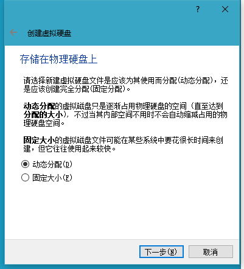

# 
多言无益， 不迈过安装系统这个坎你是永远都学习不会Linux的， 更不可能成为它的爱好者。
Linux的系统安装并不比Widnows的安装难，也并不比Windows系统的安装简单，选择何种方式安装也是可以

## 通用安装步骤
本文中我会通过使用Virtualbox 这款软件，来演示Majaro Linux系统的安装步骤。
VirtualBox 的下载地址我就不贴了，自己去搜索下载就行了。Manjaro Linux 的下载地址也一样， 不过两个都推荐去官网下载，以免中毒找我麻烦。

0. VirtualBox安装与设置   
    如果你想直接装Linux到你的电脑上可以从第一节开始看起
    1) 下载virtualbox
    2) 安装virtualbox
    3) 创建Linux虚拟机，在创建虚拟机之前，请在BIOS里面确保开启了Intel VT-X的支持，否则只能安装32位的Linux    
    创建步骤：如下   
    由于是Manjaro，是基于Archlinux的，VirtualBox未列出，可以选择Archlinux
        
    如果这个虚拟机你要用起来流畅，请至少设置 2048M内存
        
    创建虚拟硬盘时候选择任何格式都可以，但容量推荐20GB以上
    
    
    
       
    至此新建虚拟机完成，下面需要进行一些设置，大家按图索骥   
    
    
    
        
    设置完虚拟机，大家需要设置一下你的安装文件的位置，如下图   
    
    

1. 准备 U盘， Linux发行版镜像
   推荐使用一些工具如Rufus等把自己要装的系统DD到U盘上， 具体很简单这里就不给图示了。
   制作好U盘启动盘之后，可以把U盘插入电脑的USB口，开机按F2/Delete 进入BIOS设置从U盘启动， 具体的型号可能按键不一样，大家如果不清楚可以看开机时的提示语或者自行搜索。
2. 电脑 
    你要有一个硬件完好的电脑，如果你幻想使用Linux来拯救硬件本身就是坏的电脑，就别想了, 软件是不能修复硬件的，物理的硬件需要用物理的方法解决。
3. 硬盘分区，挂载分区
    
4. 选定键盘与区域和语言
5. 创建用户
6. 安装Bootloader
7. 安装Xserver
8. 安装桌面环境
9. 安装登陆管理器
10. 安装其他应用软件

## 图形界面(GUI) 安装的例子

## 命令行（CLI）安装的例子
